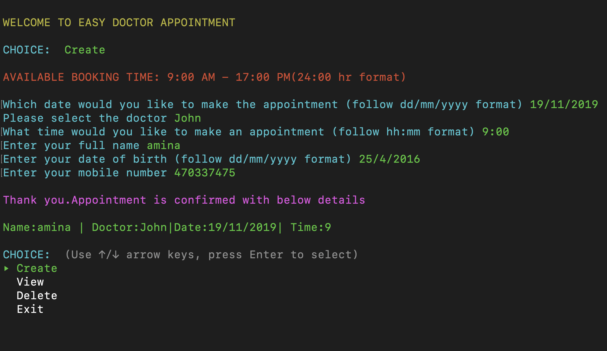

# Software Development Plan

## Purpose and Scope:

Easy Doctor appointment is a terminal application to help doctors and clinics for hassle-free appointment booking of their patients. No manual tracking of appointments are required and this user friendly application makes the process of appointment booking easy for both doctors and clinics.

The target audience of the application are Doctors and Clinics. When patients walk-in or call, easy doctor appointment application help the doctors and clinics  to book the appointment quickly and easily.

Main Feature of this application are create new appointment, view all appointments and delete appointment.

## Features:
Main Features of this application are
##### Home page: 
Home page will display options for Create, View and Delete Appointments and Exit application and user can select any of this option to proceed. Home  page displays available booking time which can be configured in the application via command line argument.

##### Create new appointment:
This feature is used to create new appointments. User can create new appointment by selecting create option from home screen. When user selects the create option from the home page, the user should enter the details of  Doctor Name, Date and Time;  when the user enters the details, the application checks that the appointment is available before proceeding to ask user for more details. Once the user enters all the information the appointment details are saved and a success message is shown to the user. Other functionalities which is part of this feature are 
* Error message is shown if appointment time user entered is not between available booking time.
* Error is displayed if no slot is available while creating appointment. 

##### View appointments:
This feature is to view all the appointments of the day. User can view appointments by selecting view option from home screen. When user select this option from the home page, user is prompted to enter the date, when the user enters the date,  the system will search for all the appointments  for that date and display all the appointments for that day to the user.
* No available Appointment message is shown if no appointment is available on the selected day.

##### Delete appointment:
User can delete an appointment using this feature. User can delete an appointments by selecting the delete option from home screen. When the user selects this option from the home page, user is prompted to enter the doctor name, date and time. Once user enters the details then the system will delete the appointment from the system and shown success message to user.
* Error message is shown if no matching appointment is available to delete.

##### Exit:
Last feature of the application is exit. If the user wants to exit the program, user can select exit option from home screen. 
* When exiting the program all the appointment details are saved to disk storage to load all the appointments back when the application is started again.

## User Interaction and Experience:

When application starts, the user will be presented a home page with options to Create,View, Delete and Exit appointments. User can select any of the above option to proceed.

* If user selects **Create** ,the system will ask for the details (Doctor,date and time) to make the appointments, also check the availability for the appointment. If the appointment is available then the system will ask for personal details ( Full Name, Date Of Birth, Mobile Number) finally the system will display appointment confirmation message. 

* If the appointment slot is not available then the system will display the error message. 

* If the user select **View** option from the home page, user is prompted to enter the date. When the user enters the date, the system will search for all the appointments for that date and display all the appointments for that day to the user.
* No available Appointment message is shown if no appointment is available on the selected day
  

* If the user selects the **Delete** option from the home page, user is prompted to enter the doctor name, date and time. Once user enters the details then the system will delete the appointment from the system and shown success message to user. Error message is shown if no matching appointment is available to delete.

## Control Flow Diagram:

  

